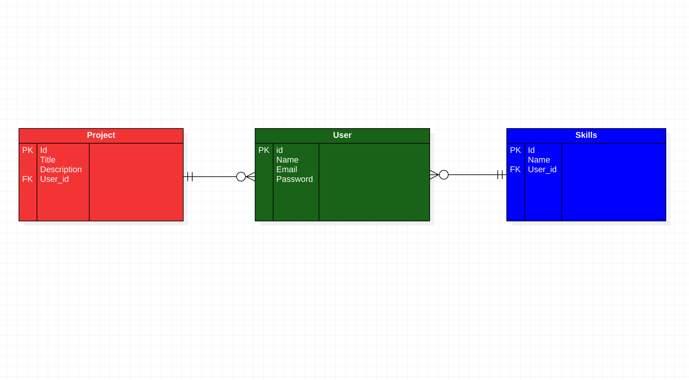

[](https://github.com/Jobwawesh/my-portfolio-app-backend/graphs/commit-activity)
[](http://makeapullrequest.com)
[](https://svgshare.com/i/Zhy.svg)
[](https://github.com/ellerbrock/open-source-badges/)

# My-Portfolio-App
Welcome to my-porfolio app. <br>
This is  an app that allows you to add projects that one is working oon and beable to see other peoples' projects at the same time.
This being a backend repository, it contains all the data for the app.<br>
To try out the fully functioning app, got to:<br>
         (https://github.com/Jobwawesh/my-portfolio-app-frontend)


## Entity Relationship Diagram(ERD)
This ERD is here to demonstrate the relationship between this project's entities.



## Pre-Requisites
In order to use this repository you will need the following:


- Operating System **(Windows `10+`, Linux `3.8+`, or MacOS X `10.7+`)**
- RAM >= 4GB
- Free Space >= 2GB

## Built With
This application has been built with the following tools:


- **Ruby `v2.7.+`**
- **SQlite3 `v1.6`**
- **ActiveRecord `v7.0.4`**
- **Rake `v13.0.6`**
- **Puma `v6.1`**
- **rerun `v0.14`**
- **Sinatra `v3.0.5`**
- **Bootstrap `v5.3.0`**
- **ERB `v4.0`**

## Setup
You can setup this repository by following this manual

1. Clone the repository
    ```{shell}
   git clone https://github.com/Jobwawesh/my-portfolio-app-backend
   ```
2. Ensure the ruby gems are setup in your machine
    ```{shell}
   bundle install
   ```
3. Perform any pending database migrations
   ```{shell}
   rake db:migrate
   ```
4. Run the application
    ```{shell}
    rake start
    ```
5. Open the application from your browser
    ```
   http://localhost:9292
   ```
   
## Application
This application is a simple web API that allows users to:

- Register a new account.
- Log in to existing account.
- Create a PROJECT items.
- View all PROJECT items.
- Update a PROJECT Item
- Delete a PROJECT item.
- Create a SKILL
- Delete a SKILL

### MODELS
Database schema definitions.

#### PROJECT

| COLUMN      | DATA TYPE                                       | DESCRIPTION                            | 
|-------------|-------------------------------------------------|----------------------------------------|
| id          | Integer                                         | Unique identifier.                     |
| title       | String                                          | The name of the project.               |
| description | String                                          | A short description about the project. |
| due         | Date                                            | The set due date for the project.      |
| createdAt   | Date                                            | The date the task was created.         |
| status      | ENUM `[CREATED, ONGOING, COMPLETED, CANCELLED]` | TThe status of the task.               |


### SKILL
| COLUMN        | DATA TYPE | DESCRIPTION                           | 
|---------------|-----------|---------------------------------------|
| id            | Integer   | Unique identifier.                    |
| name          | String    | User's full name.                     |
| createdAt     | Date      | The date the skill was created.       |


#### USER
| COLUMN        | DATA TYPE | DESCRIPTION                           | 
|---------------|-----------|---------------------------------------|
| id            | Integer   | Unique identifier.                    |
| full_name     | String    | User's full name.                     |
| password_hash | String    | User's password hashed with `BCrypt`. |
| updated_at    | Date      | The date the user was updated.        |
| createdAt     | Date      | The date the user was created.        |


### ROUTES

1. `/hello` - Presents a simple welcome message.
2. `/auth/register` - Create a new user account.
   
   ```{json}
   ## REQUEST BODY
   {
    "full_name": "John Doe",
    "email": "mail@mail.com",
    "password": "12345678"
   }
   ```
3. `/auth/login` - Log in a user using email and password.

   ```{json}
   ## REQUEST BODY
   {
    "email": "mail@mail.com",
    "password": "12345678"
   }
   ```
4. `/projects/create` - Add a new PROJECT item.

   ```{json}
   ## REQUEST BODY
   {
    "title": "a sample",
    "description": "This is a sample project",
   }
   ```
5. `/projects` - List all PROJECT items.

   ```{json}
   ## RESPONSE SAMPLE
   {
    "data": [
        {
            "id": 2,
            "title": "Yet another sample 2",
            "description": "Just a project description sample",
            "createdAt": "2023-02-24T09:34:41.856Z",
            "status": "CREATED"
        }],
    "message": "SUCCESS"
   }
   ```
6. `/project/update/:id` - Update an existing PROJECT.
7. `/project/delete/:id` - Delete a PROJECT item.

8. `/skill/create` - Add a new SKILL item.

   ```{json}
   ## REQUEST BODY
   {
    "name": "a sample",
   }
   ```
9. `/skill` - List all SKILL items.

   ```{json}
   ## RESPONSE SAMPLE
   {
    "data": [
        {
            "id": 2,
            "title": "Yet another sample 2",
            "createdAt": "2023-02-24T09:34:41.856Z",
            "status": "CREATED"
        }],
    "message": "SUCCESS"
   }
   ```
10. `/skill/update/:id` - Update an existing SKILL.
11. `/skill/delete/:id` - Delete a SKILL item.


## LICENSE
Mozilla Public License Version 2.0

## Author
This repository is maintained by:

- [Job Waweru](https://github.com/Jobwawesh) 